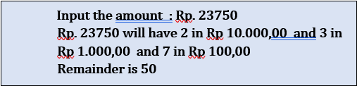

# Module 1 Tasks
1.	Write a program that convert days unit into hour unit, minutes unit and seconds unit.  
The days unit input by user. Display the result of convert for each unit with below format. Output of the program example is shown below. (In here, xx is a number). 

Save the program with name convertDay.cpp. Remember to compile your code and test your code if it works as per problem requirement.

2. Write a program that calculate money into Rp 10.000,00, Rp 1.000,00, Rp 100,00 unit. Display the amount of each unit and the remainder.  Example:

Save it with name moneyChanger.cpp.
Remember to compile your code and test your code if it works as per problem requirement.
