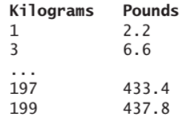
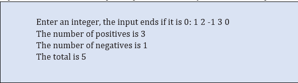

# Tasks
1.	Write a code to print this conversion table from kilogram to pounds. You are free to use any looping method. (while, do-while or for).
Remember that cout command print anything you put in “ “ command. For this problem, you need to print space manually and change the line every iteration.

 
2.	Write a code that reads an unspecified number of integers, determines how many positive and negative values have been read, and computes the total . Your program ends with the input 0.  Please see the sample output below and try to make the output exactly like this.

